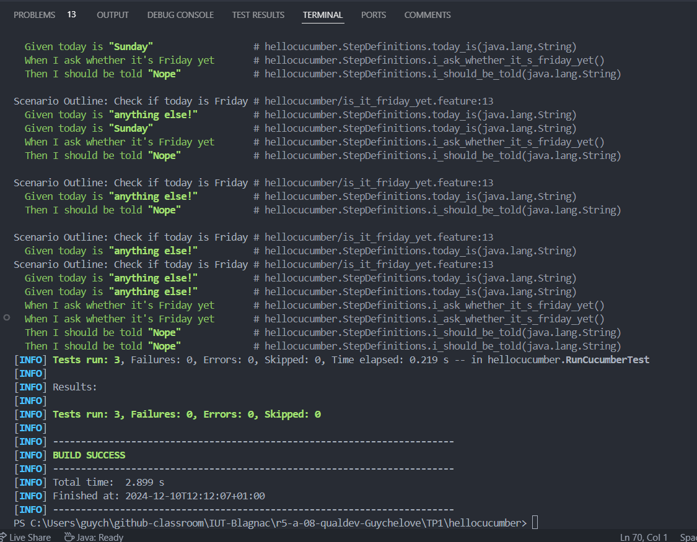
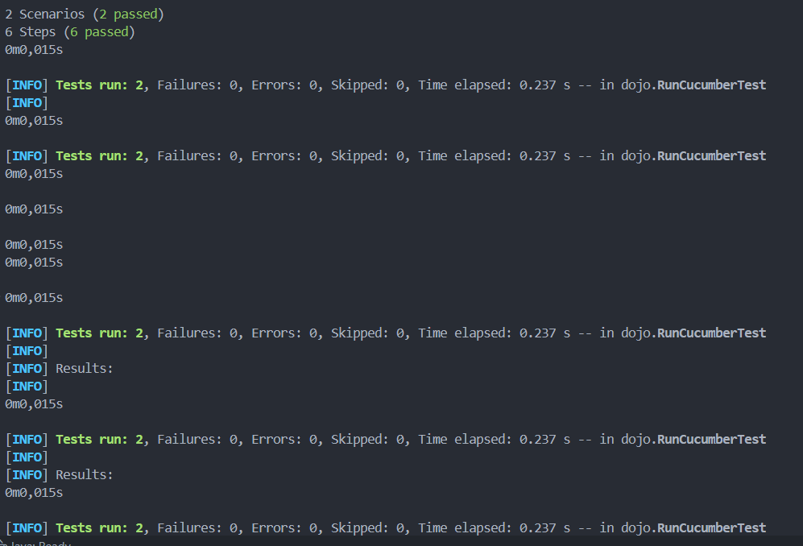
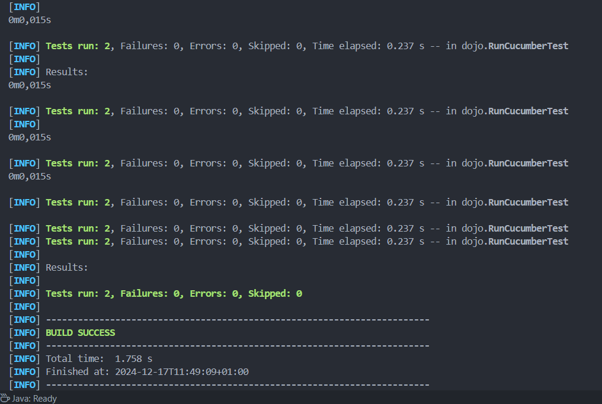

= R5.A.08 -- Dépôt pour les TPs
:icons: font
:MoSCoW: https://fr.wikipedia.org/wiki/M%C3%A9thode_MoSCoW[MoSCoW]

Ce dépôt concerne les rendus de mailto:A_changer@etu.univ-tlse2.fr[Jonh Doe].

== Qualité - Sujet TP 1 - Cucumber

=== Description

Dans ce TP, nous avons vu comment utiliser Cucumber pour écrire des scénarios de test en langage naturel. Nous avons également vu comment utiliser JUnit pour exécuter ces scénarios de test.

=== Scénarios de test

Voici les fichiers utilisés pour les tests :

`Stepdefinitions.java` :

[source,java]
---
 @Given("today is {string}")
    public void today_is(String string) {
        // Write code here that turns the phrase above into concrete actions
        today = string;
    }

    @Given("today is Sunday")
    public void today_is_sunday() {
        // Cette étape initialise la variable 'today' à "Sunday"
        today = "Sunday";
    }

    @When("I ask whether it's Friday yet")
    public void i_ask_whether_it_s_friday_yet() {
        // Cette étape appelle la méthode 'isItFriday' pour vérifier si c'est vendredi
        answer = IsItFriday.isItFriday(today);
    }

    @Then("I should be told {string}")
    public void i_should_be_told(String expectedAnswer) {
        // Cette étape compare la réponse retournée par 'isItFriday' avec la réponse
        // attendue
        assertEquals(expectedAnswer, answer);
    }

    @Given("today is Friday")
    public void today_is_friday() {
        // Cette étape initialise la variable 'today' à "Friday"
        today = "Friday";
    }
---

`is_it_friday_yet.feature` :

[source,gherkin]
---
Feature: Is it Friday yet?
  Everybody wants to know when it's Friday

  Scenario Outline: Check if today is Friday
    Given today is "<day>"
    When I ask whether it's Friday yet
    Then I should be told "<answer>"

  Examples:
    | day            | answer |
    | Friday         | TGIF   |
    | Sunday         | Nope   |
    | anything else! | Nope   |

---

== Qualité - Sujet TP 2 - Cucumber avec java

=== Description

Dans ce TP2, nous avons utilisé **Cucumber avec Java** pour approfondir la démarche **BDD (Behavior-Driven Development)**. Le travail consistait à écrire des scénarios de test en langage naturel dans un fichier `.feature`, puis à les exécuter à l’aide de **JUnit**. Nous avons configuré un projet Maven avec les dépendances nécessaires, créé et implémenté les steps associés en Java, et paramétré les scénarios pour tester différents cas. Enfin, nous avons exploré l’utilisation des **Scenario Outlines** pour automatiser les tests sur des données multiples, tout en mettant en avant l’importance de développer en fonction des exigences métier.

=== Scénarios de test

Voici les fichiers utilisés pour les tests :

`CocktailSteps.java` :

[source,java]
---
/ Paramétrer le nom de la personne qui veut acheter un verre
    @Given("{string} who wants to buy a drink")
    public void declareOwner(String owner) {
        order = new Order();
        order.declareOwner(owner); // Le nom de la personne qui veut acheter un verre est paramétré
    }

    // Paramétrer la personne pour qui l'on commande le verre
    @When("an order is declared for {string}")
    public void declareTarget(String target) {
        order.declareTarget(target); // Le nom de la personne pour qui la commande est faite est paramétré
    }

    // Ajouter des cocktails à la commande
    @When("{string} adds {int} cocktail\\(s) to the order")
    public void adds_cocktail_s_to_the_order(String string, int int1) {
        order.declareOwner(string); // Déclare le propriétaire de la commande, même si ce n'est pas nécessaire dans
                                    // le contexte.
        order.addCocktails(int1); // Ajoute les cocktails à la commande
    }

    // Vérifier qu'il n'y a pas de cocktails dans la commande
    @Then("there are {int} cocktail\\(s) in the order")
    public void there_are_cocktail_s_in_the_order(int int1) {
        List<String> cocktails = order.getCocktails(); // Récupère la liste des cocktails dans la commande
        assertEquals(int1, cocktails.size()); // Vérifie que la taille de la liste correspond au nombre attendu
    }
---

`cocktail.feature` :

[source,gherkin]
---

Feature: Cocktail Ordering

  As a person who wants to buy a drink, I want to offer a drink to someone so that we can discuss together.

  Scenario: Creating an empty order
    Given "Romeo" who wants to buy a drink
    When "Romeo" adds 0 cocktail(s) to the order
    Then there are 0 cocktail(s) in the order

  Scenario: Adding cocktails to the order
    Given "Romeo" who wants to buy a drink
    When "Romeo" adds 3 cocktail(s) to the order
    Then there are 3 cocktail(s) in the order

---

